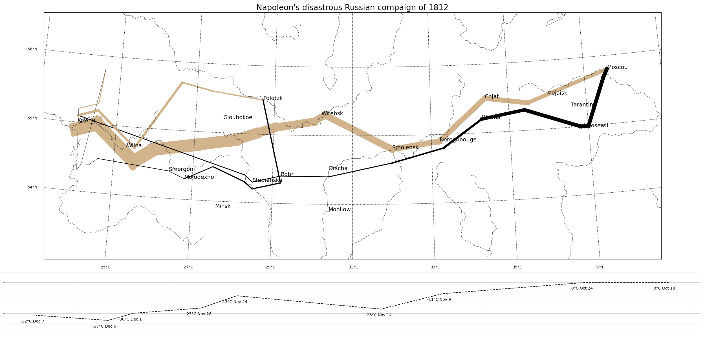
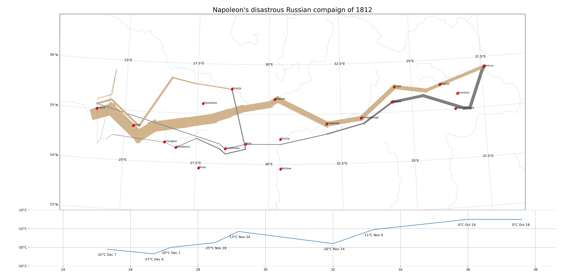

# Data Viz Practice 2: Napoleon's disastrous Russian compaign of 1812

## Introduction
This project "Napoleon's disastrous Russian campaign of 1812" reproduces the data visualization of the famous [Charles Minard's Napoleon's disastrous Russian campaign of 1812](https://en.wikipedia.org/wiki/Charles_Joseph_Minard#/media/File:Minard.png). We used `pandas` and `sqlite3` to establish the database, and used `matplotlib` and `basemap`(and `Cartopy`) to conduct proof of concept and create the finished product.

## How to reproduce
* Install [miniconda](https://docs.anaconda.com/miniconda)
* Create environment via `environment.yml`
``` bash
conda env create -f environment.yml
```
* Place minard.txt into data/ folder
* `conda activate minard_clone` and 
  `python create_minard_db.py` to create gapminder.db
* `python plot_with_basemap.py` to create minard_clone_basemap.png


* `python plot_with_cartopy.py` to create minard_clone_cartopy.png


## Cartopy
According to documents, basemap is no more maintained. It is recommanded to use Cartopy in map drawing. Therefore, I try to implement the same data viz with cartopy as well.

## Python Review
- with as: 
```python
with open(file_path, 'r') as f:
    data = f.read()
# f.close() will be excuted automatically in the end of with block
```

### Pandas
- astype: DataFrame.astype(dataType)
- .str.cat()
- dataframe.shape

### Matplotlib
- to understand the relationship between figure and axes
- to understand gridSpec on layout.

